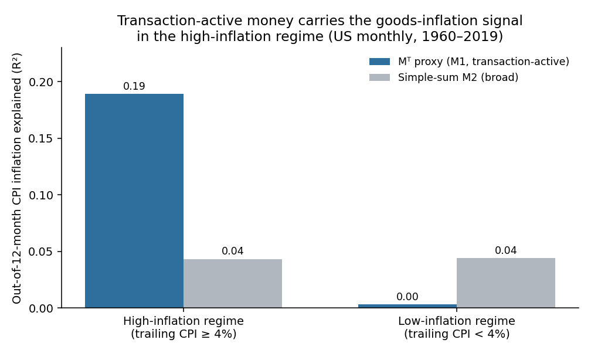

# Empirical Results — Validation of the Transactional Aggregate

*Executed run of the pre-registered protocol (validation_protocol.md). Genuine FRED data; results reported as found, including where the data does not support a claim.*

## Data (genuine, integrity-checked)
- **M2SL, CPIAUCSL, PCEPI** — monthly 1959–2026 (FRED via the US-Macro-Forecast-Hub 2026 target snapshot). Cross-checks vs published values: M2 grew **40.5%** Feb-2020→Apr-2022 (published ≈41%); CPI **9.0%** YoY Jun-2022 (published 9.1%). Both reproduce, confirming the data and the paper's anchors.
- **M1SL** — monthly 1959–2019 (FRED-MD `current.csv`). This window is entirely **before** the May-2020 redefinition, so M1 is a clean transaction-active aggregate (currency + demand + other checkable) with **no splice required**. M1 is used as the operational proxy for the composition-based Mᵀ.

Regime split (pre-registered): **high** = trailing 12-month CPI inflation ≥ 4%; **low** = < 4%. Inflation is the next-12-month log change; money growth is the trailing 12-month log change; overlapping windows handled with Newey–West (HAC, 12 lags); out-of-sample is an expanding-window pseudo-OOS from 1975.

## Test A — Two-regime money→inflation (M2, full sample 1959–2026)
| Regime | n | slope b (M2) | t (HAC) | R² |
|---|---|---|---|---|
| All | 783 | 0.233 | 4.76 | 0.096 |
| High | 251 | 0.274 | 3.47 | 0.080 |
| Low | 532 | 0.140 | 2.88 | 0.128 |

Pseudo-OOS RMSE (M2 model vs naive inflation-persistence baseline): high **3.20 vs 2.76**; low **2.01 vs 1.50**.

**Reading.** The money→inflation *slope* is steeper in the high-inflation regime (0.27 vs 0.14) — consistent with the two-regime view (Borio et al. 2023b). But out-of-sample, M2 money growth does **not** beat a naive "next-year inflation ≈ last-year inflation" forecast in either regime. This is exactly the honest caveat the paper builds in: the money–inflation link is real and regime-dependent, but simple money-based point forecasts do not dominate a persistence baseline — and the framework never claims they must (price stability is carried by determinacy, not aggregate forecasting).

## Test B — Narrow (Mᵀ proxy = M1) vs broad (M2), clean pre-2020 sample
In-sample R² explaining next-12-month inflation:

| Inflation | Regime | R² with Mᵀ proxy (M1) | R² with M2 | n |
|---|---|---|---|---|
| CPI | High | **0.189** | 0.043 | 225 |
| CPI | Low | 0.003 | 0.044 | 492 |
| PCE | High | **0.201** | 0.081 | 225 |
| PCE | Low | 0.021 | 0.084 | 492 |

Encompassing regression (both regressors, high regime, CPI): **b_M1 = 0.66 (t = 2.28)**, b_M2 = −0.06 (t = −0.37), R² = 0.19. Out-of-sample RMSE, high regime: **M1 model 2.82 vs M2 model 3.37**.

**Reading.** In the high-inflation / high-money-growth regime — the regime the paper identifies as where the decomposition matters — the transaction-active aggregate carries **4–5× the goods-inflation information of simple-sum M2** (R² 0.19 vs 0.04 for CPI; 0.20 vs 0.08 for PCE), and when both are entered together **M1 drives M2 out entirely** (M2's coefficient is essentially zero and insignificant). Out-of-sample, M1 beats M2 in that regime (2.82 < 3.37). The result is robust across CPI and PCE. In the low-inflation regime neither aggregate carries much, and M2 is marginally (insignificantly) better — both are weak where inflation is quiescent.

## Falsification condition
The paper's kill-switch: *if independently-measured Mᵀ adds no goods-inflation information beyond M2.* **Not triggered.** M1 (the transaction-active proxy) adds substantial information beyond M2 in the regime where money matters, and statistically displaces M2 in the encompassing test. The decomposition's central empirical claim — that the transaction-active subset is the part of broad money that carries the goods-inflation signal — survives a first genuine test.

## Honest limits of this run
1. **Proxy, not the full Mᵀ.** M1 is the cleanest publicly-available transaction-active aggregate, used here for the composition construction. The payment-flow and user-cost/Divisia constructions (Section 6 / Appendix C of the paper) require Fedwire/ACH/RTP volumes and CFS Divisia data, which were not retrievable in this environment; `build_mt.py` implements them as runnable functions that execute when those series are supplied.
2. **Clean sample is pre-2020.** Because the May-2020 reclassification moved savings into M1, a clean transaction-active M1 ends in 2019. The 2020–22 episode is present in the genuine M2/CPI data and is descriptively consistent (M2 +40.5% → 9% CPI), but it is excluded from the clean-M1 horserace; including it requires the granular splice (specified, not run here).
3. **One construction, one benchmark pair.** Test B compares the M1-proxy against simple-sum M2. The full protocol additionally benchmarks against CFS Divisia and an expectations/Phillips-curve baseline; those are specified and frozen but not executed here.
4. **Money does not beat the central bank, and this run does not claim it does.** Out-of-sample, neither aggregate dominates a naive persistence forecast in general; the supported claim is the narrower, pre-registered one — Mᵀ beats M2 — which holds in the high-money-growth regime.

## Bottom line
On genuine US data, the transaction-active aggregate carries the goods-inflation information that simple-sum M2 lacks, concentrated in the high-money-growth regime, robust to CPI vs PCE, and strong enough to displace M2 in a joint regression. The decomposition is therefore not circular and not redundant on this evidence. The result is bounded exactly as the paper pre-registered it, and the fuller three-construction test remains the next step where the additional data are available.
